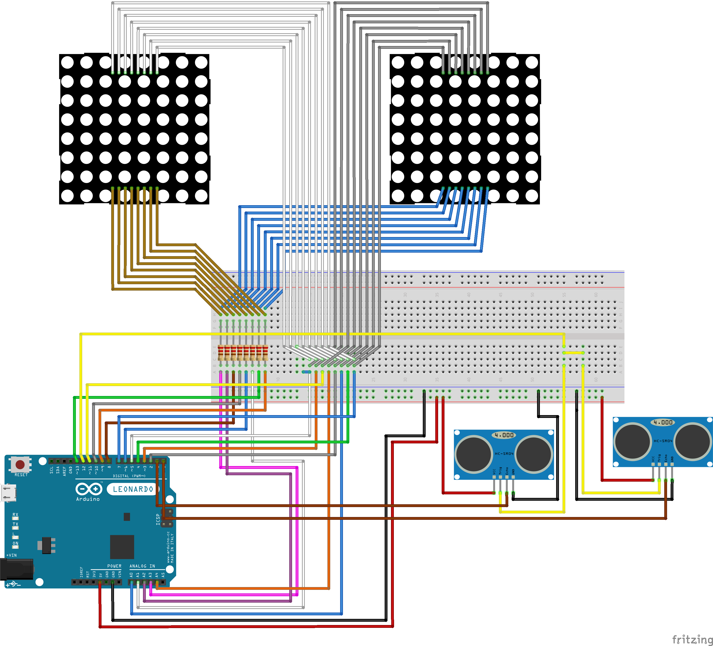

Soutenance
=====

# Présentation du projet
Le projet est un projet Arduino mettant en place deux matrices de LED 8x8 reproduisant des yeux et suivant du regard une personne se déplaçant grâce à l'utilisation de télémètres à ultrasons pour détecter l'emplacement de la personne.

# Composants utilisés
Pour ce projet les composants suivants ont été utilisés : 
- 1 carte Arduino Leonardo,
- 2 matrices de LED 8x8,
- 2 télémètres à ultrasons,
- Plusieurs résistances et une Breadboard.

# Outils utilisés
Les outils utilisés ont été les suivants :
- Le logiciel `Arduino` (pour développer le code C++ du projet),
- Le logiciel `Fritzing` (pour documenter les branchements du projet).

# Fritzing
Voici le document Fritzing du projet, référençant tous les branchements nécessaires pour faire fonctionner les yeux :



# Présentation
La soutenance finale s'est déroulée autour d'une présentation et d'une démonstration. La présentation est disponible au format PDF dans ce dossier.

# Code
Le code à envoyer sur la carte Arduino est disponible dans ce même dossier et à été développé en C++.

Dans les grandes lignes, le code fonctionne de cette façon :
- A l'initialisation, 
   - On lance un système d'interruption sur le changement de valeur des pins des télémètres,
   - On a préalablement définie des "images" qui contiennent les mouvements des yeux,
- On boucle en affichant une image définie,
- Lorsque une interruption intervient, on re-définie l'image à afficher en fonction des valeurs des télémètres,
- Au prochain tour de boucle, on affiche la nouvelle image.

````C++
attachInterrupt(digitalPinToInterrupt(ECHO_LEFT), InterruptLeft, CHANGE);
attachInterrupt(digitalPinToInterrupt(ECHO_RIGHT), InterruptRight, CHANGE);
````

````C++
void SetImage() {
	if (micros() - startTime >= TIME_MEASURE) {
		// Condition sur la distance la plus courte droite ou gauche avec un objet.
		if (lastPulseTimeLeft > MAX_DISTANCE && lastPulseTimeRight > MAX_DISTANCE)
		{
			imageState = FORWARD_STATE;
			currentImage = eyeForward;
		}
		else if (lastPulseTimeLeft > lastPulseTimeRight)
		{
			currentImage = eyeRight;
			if (imageState != RIGHT_STATE) {
				currentImage = eyeForward;
				imageState = RIGHT_STATE;
			}
		}
		else if (lastPulseTimeLeft < lastPulseTimeRight)
		{
			currentImage = eyeLeft;
			if (imageState != LEFT_STATE)
			{
				currentImage = eyeForward;
				imageState = LEFT_STATE;
			}
		}

		// Emet l'ultrason
		digitalWrite(TRIGGER, HIGH);
		delayMicroseconds(10);
		digitalWrite(TRIGGER, LOW);

		// Reset
		lastPulseTimeLeft = lastPulseTimeRight = 0;
	}
}
````

````C++
void loop() {
	// Condition pour cligner des yeux
	if (startTimerBlink + TIME_BLINK < micros())
	{
		currentImage = eyeBlink;
		startTimerBlink = micros();
		blinked = true;
	}

	showImage(currentImage, 200);

	// Si on a fermé les yeux -> On les rouvre pour cligner
	if (blinked)
	{
		currentImage = eyeForward;
		blinked = false;
	}

	// On appelle pour savoir quelle image afficher
	SetImage();
}
````

# Auteurs
Les auteurs de ce projet sont : **Salomé RUSSIER**, **Pierre BOUDON** et **Inas AIT MANSOUR**.
